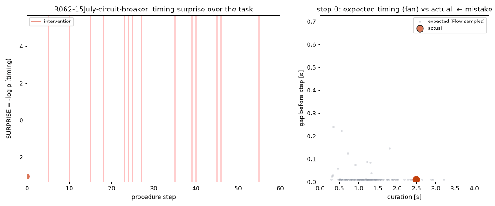
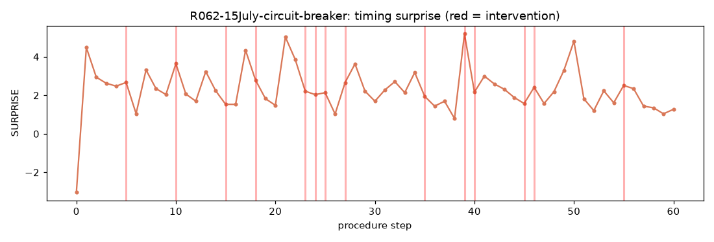
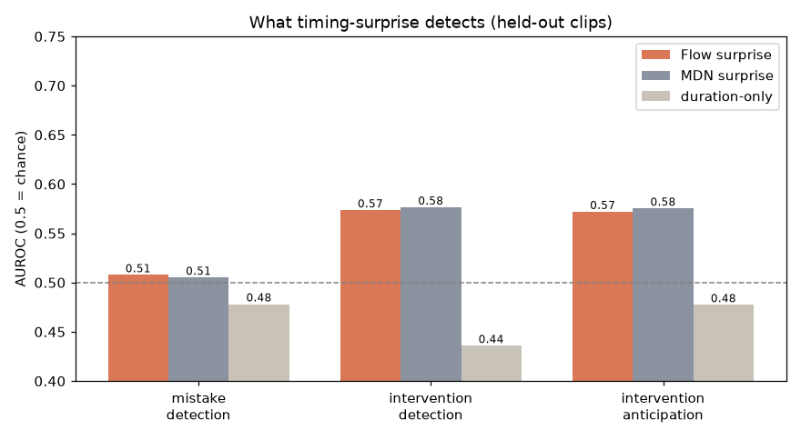
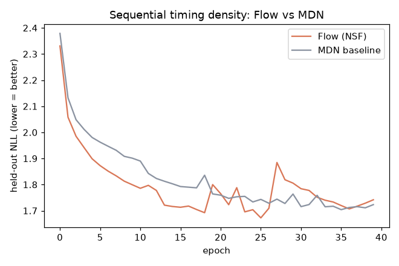

# HoloAssist-NF — 手順の「タイミング」を逐次 Normalizing Flow で（実験C）

手順タスクの**ペース（各ステップの所要時間・間）**を、履歴で条件づけた**逐次** Normalizing Flow で `log p(タイミング | これまでの手順, 行動)` として学習し、**SURPRISE = −log p** で「ミス／指導者の介入」を先読みできるかを見る実験。実験Aで眠らせていた **逐次の厳密尤度・生成・予兆** を起こすのが狙い。NF forget/mistake シリーズ(A–E)の C。図・数値は `python -m holo.report` で自動生成。

## 元データの中身（何が入っているか）

<b>生データ</b>＝HoloAssist の<b>注釈JSON</b>（動画不使用・ログイン不要）。各<b>クリップ</b>＝手順の<b>行動区間の系列</b> <code>[開始秒, 終了秒, ラベル5次元]</code>、加えて <b>ミス(Correct/Wrong)</b> と <b>指導者の介入</b> の注釈型。<br><b>1レコードの実例</b>：クリップ <code>R0027-12</code> の手順3番目 ＝ <code>12.22–16.10秒</code>（所要3.9秒）、動作コード1・対象コード1、ミス=0、介入=0。<br>→ 学習に使ったのは <b>各ステップの所要時間・直前ステップとの間</b>（log化）＋動作/対象コード＋ミス/介入。計 142,664 ステップ。<b>手ポーズ・視線・物体などの生ストリームは含まない</b>（注釈のみ）。

## どんなデータか

- **HoloAssist**（作業者＋指導者の協働タスク）の**オープン注釈のみ**を使用（動画不要・ログイン不要）。
- 各クリップ＝行動区間の系列 `[開始, 終了, ラベル]`。ここから **所要時間・直前ステップとの間**を計算。
- 注釈：**fine-grained action**（17,905 検証ステップ）＋**mistake（Correct/Wrong）**＋**intervention（指導者の介入）**。検証集合のミス率 0.2633 / 介入率 0.0338。

## どんなモデルを学習したか

- **逐次条件付き NSF**：`x = (log所要時間, log間)` ／ `c = GRU(過去ステップの行動埋め込み+タイミング) + 現ステップの行動`。
- 比較のため **MDN（ガウス混合）ベースライン**も同条件で学習（実験Aの教訓＝『ガウス混合に並ばれたら勝ちでない』を毎回検証）。
- スコア **SURPRISE = −log p(タイミング | 履歴, 行動)**。

## 結果（正直に）

- **密度の当てはまりは Flow の勝ち**：held-out NLL **Flow `1.672` < MDN `1.704`**（低いほど良い）。手順タイミングの非ガウス・多峰性にNFの表現力が効く＝**Aの『ガウスに並ばれた』を克服**。
- **介入の検出/予兆は弱いが偶然超え**：AUROC 介入 `0.5735` / 予兆(次3手以内) `0.5719`。介入直前のサプライズ `1.935` > 他 `1.646`。
- **ミス検出はほぼ偶然**：AUROC `0.5077`。『間違い』はタイミングでなく*意味（行動の正誤）*の異常だから、という正直な限界。
- **AUCでは Flow ≈ MDN**：下流の天井は*モデル*でなく*信号（タイミング単独）*側にある。→ 動作・視線（rawストリーム）を足す拡張(C4)の動機。

## 図の見方

### リプレイ：手順の進行に沿ってタイミング・サプライズが動く＋Flowが期待タイミングを生成



**左**＝手順ステップ順に並べた **サプライズ = −log p(タイミング)** の推移。赤い縦線＝指導者の介入。**右**＝各ステップでFlowが**サンプリングで生成した「期待される所要時間・間の分布(fan)」**（灰）と、実際の値（オレンジ／ミスは濃橙／介入は赤）。**見どころ**：Aで眠らせていた*逐次の厳密尤度*と*生成*を使えている。実測が灰の雲から外れる＝pace異常。

### 1クリップのサプライズ時系列（赤＝介入）



手順が進むにつれサプライズがどう動くか。介入(赤線)の周辺でやや持ち上がる傾向はあるが、単発のスパイクで介入を当てられるほど強くはない（下のAUC参照）。

### タイミング・サプライズは何を検出できるか（Flow / MDN / 所要時間のみ）



3課題×3手法のAUROC（0.5=偶然）。**見どころ**：①ミス検出はほぼ偶然(≈0.51)＝「間違い」はタイミングでなく*意味*の異常。②介入の検出/予兆は弱いが偶然超え(≈0.57)。③FlowとMDNはAUCではほぼ互角＝**下流の天井はモデルでなく信号（タイミング）側**にある。

### 密度としての当てはまり：Flow vs MDN（held-out NLL）



**ここがNFの本質的な勝ち**：held-out NLLで **Flow < MDN**（低いほど良い）。手順タイミングの分布は非ガウス・多峰で、Neural Spline Flowの表現力が効く＝実験Aで『ガウスに並ばれた』反省を、密度の指標では克服できている。

## 再現手順

```bash
python -m holo.fetch      # HoloAssistオープン注釈を取得
python -m holo.extract    # -> data/processed/segments.parquet
python -m holo.features   # 語彙 + 正規化
python -m holo.train      # 逐次NSF + MDNベースライン（--fastで高速）
python -m holo.evaluate   # ミス/介入/予兆のAUC
python -m holo.replay     # サプライズ時系列 + 期待タイミングfan（GIF/MP4）
python -m holo.report     # 図 + この日本語README + index.html
```

## 考察：どんなフォーマットのデータがあれば何ができるか

<p>本実装は「<b>行動区間＋タイミング</b>」だけ。タイミング単独では『間違いの意味』は取れない。データの列がこう増えると、こんな学習に広がる：</p><ul><li><b>＋手ポーズ・視線・物体（生ストリーム）</b> → 『やり方の異常＝意味的ミス』に近づく（本実装のミス検出 0.51＝ほぼ勘、の処方箋）。</li><li><b>＋正解手順（レシピDAG／工程の依存関係）</b> → 順序違反・工程飛ばしを直接検出。</li><li><b>＋ユーザID・熟達度ラベル</b> → 個人化と<b>スキル評価</b>（熟練ほど低サプライズ）。</li><li><b>＋介入の種類ラベル</b> → 『有無』でなく『どの助けが要るか』まで予測。</li></ul>

_条件付きNFで手順の尤度を forget/mistake ポテンシャルとして測るシリーズ(A–E)の C。A=物の置き場（空間）、C=手順のタイミング（時間）。次はB(HD-EPIC: 3D配置×視線)。_